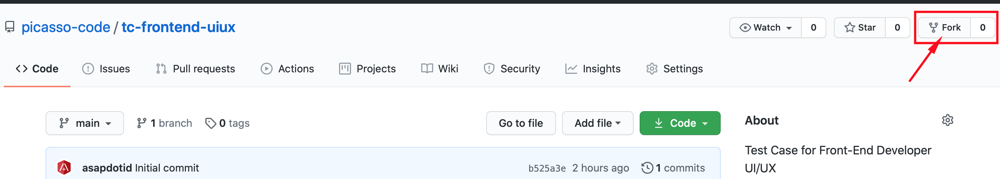

Test Case Front-End Developer (UI/UX)

## I. Diskripsi

Saat ini Picasso sedang mengembangkan system membership online, dimana terdapat beberapa fitur sebagai berikut:

| Authentication    | Dashboard      |
| ----------------- | -------------- |
| - Login           | - Account      |
| - Registrasion    | - Profile      |
| - Forgot Password | - Point        |
|                   | - Stay         |
|                   | - Invoice      |
|                   | - Inbox        |
|                   | - Notification |

Alamat url untuk website: https://member.picassorewards.com, system ini sedang dalam pengembangan terutama tampilan dan interaksi penggunaanya (UI/UX).

## II. Petunjuk Dalam Mengerjakan Soal

#### 1. Dari repository Github Test Case ini, anda diminta untuk:

- **Fork** repository ini ke akun Github anda.
- Pekerjaan anda dalam menjawab soal akan berada di repository anda, misal `https://github.com/user_akun_anda/tc-frontend-uiux`.
- Clone Repository hasil dari `fork` sebagai project di local komputer anda.
- Anda dapat menambah file atau folder sesuikan dengan kebutuhan project anda.
- Kami akan melakukan penilaian berdasarkan pekerjaan di repository Github anda.
- Setelah selesai mengerjakan soal yang diberikan sesuai dengan batas waktu yang diberikan, silahkan anda informasikan alamat repositiry Github anda, replay email soal test yang diberikan di `picassograndhotel@gmail.com`.

#### 2. Penilaian

- User Interface (Responsive)
- User Experience
- Clean Code
- CSS/SCSS metode BEM (nilai plus)

## III. Soal

1.  Anda diminta untuk mengunjungi website Membership Picasso https://member.picassorewards.com, mulai dari halaman Authetication & Dashboard. Untuk halaman Dashboard, anda terlebih dahulu registrasi.

    Pertanyaan:

        a. Kritik masing-masing halaman?
        b. Analisa dan saran masing-masing halaman?

    > Untuk jawaban a & b anda bisa tambahkan dibagian **_Jawaban_** (bawah) file README.md.

2.  Dari analisa dan saran (soal 1) menurut anda,
    kami meminta anda untuk membuat design UI/UX baru `(HTML-CSS-JavaScript)`:

    Beberapa bagian atau halaman yang anda buat:

        a. Login

        b. register

        c. Forgot Password

        d. Dashboard Member

        e. Account

        f. Profile

    Catatan:

        - Design yang dibuat memperlihatkan data yng ditampilkan.
        - Anda bebas menggunakan CSS Framework
        - ***Optional*** untuk menggunakan JavaSript Framework (Vue Js, React Js, dll)
        - UI responsive
        - Nilai + jika CSS/SCSS yang dikerjakan menggunakan teknik **BEM**
        - Push pekerjaan anda di repository Github fork.

---

Selamat Mengerjakan.

---

## Jawaban Anda

1a.)    a. Login
           Menurut saya tampilan halaman login terlalu lebar, logonya terlalu besar, gambar backgroundnya terlalu ramai.

        b. register
           Menurut saya selain gambar backgroundnya yang terlalu ramai, terdapat field referral code yang tidak tahu untuk apa kegunaannya.

        c. Forgot Password
           Menurut saya gambar backgroundnya terlalu ramai, tulisan sign in tidak perlu.

        d. Dashboard Member
           Menurut saya secara tampilan sudah bagus, hanya background yang digunakan kurang tepat, susunan posisi sudah rapi, tetapi ada beberapa tombol navigasi yang tidak perlu karena sudah ada di posisi lain contohnya tombol profile.
           Dashboardnya juga kurang responsive saat dibuka di layar yang lebih kecil.

        e. Account
           Secara tampilan sudah bagus, tetapi ada beberapa informasi fitur yang dibuat lebih dari satu, contohnya informasi my points, yang sudah ada di navigation bar bagian atas dan ada juga di dalam kolom account.

        f. Profile
           Secara tampilan sudah bagus, informasi yang dibutuhkan pengguna sudah cukup menjelaskan.

1b.)    a. Login
           Tampilan halaman sebaiknya diperkecil dan diletakkan di tengah, logo ditempatkan di atas form, background diubah menjadi warna netral atau sewarna.
           
        b. register
           background diubah menjadi warna netral atau sewarna, kolom refferal code dihapus saja.

        c. Forgot Password
           background diubah menjadi warna netral atau sewarna, tulisan sign in lebih baik diganti menjadi kembali (ke halaman sebelumnya).

        d. Dashboard Member
           Mengubah background dan menghilangkan navigasi yang kurang diperlukan karena sudah ada di tempat lainnya. Membuat dashboard menjadi responsive ketika dibuka di layar yang lebih kecil

        e. Account
           Mengubah/mengganti tampilan atau informasi my points dengan menu lain, misalnya menu inbox atau yang lainnya.
           tetapi jangan semua menu ditampilkan disitu karena terlalu banyak.

        f. Profile
           Susunan sebaiknya dibuat lebih rapi lagi, dan jangan dipisah antara profile utama dan menu contactnya, disatukan saja menjadi satu field.
